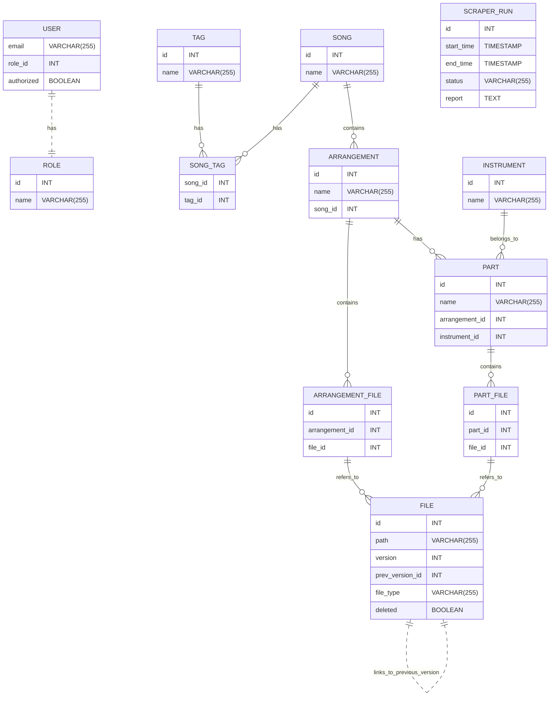

```mermaid
erDiagram
    USER ||..|| ROLE : has
    USER {
        email VARCHAR(255)
        role_id INT
        authorized BOOLEAN
    }
    ROLE {
        id INT
        name VARCHAR(255)
    }
    TAG {
        id INT
        name VARCHAR(255)
    }
    SONG {
        id INT
        name VARCHAR(255)
    }
    SONG_TAG {
        song_id INT
        tag_id INT
    }
    ARRANGEMENT {
        id INT
        name VARCHAR(255)
        song_id INT
    }
    PART {
        id INT
        name VARCHAR(255)
        arrangement_id INT
        instrument_id INT
    }
    INSTRUMENT {
        id INT
        name VARCHAR(255)
    }
    FILE {
        id INT
        path VARCHAR(255)
        version INT
        prev_version_id INT
        file_type VARCHAR(255)
        deleted BOOLEAN
    }
    ARRANGEMENT_FILE {
        id INT
        arrangement_id INT
        file_id INT
    }
    PART_FILE {
        id INT
        part_id INT
        file_id INT
    }
    SCRAPER_RUN {
        id INT
        start_time TIMESTAMP
        end_time TIMESTAMP
        status VARCHAR(255)
        report TEXT
    }
    TAG ||--o{ SONG_TAG : has
    SONG ||--o{ SONG_TAG : has
    SONG ||--o{ ARRANGEMENT : contains
    ARRANGEMENT ||--o{ PART : has
    INSTRUMENT ||--o{ PART : belongs_to
    ARRANGEMENT ||--o{ ARRANGEMENT_FILE : contains
    PART ||--o{ PART_FILE : contains
    FILE ||..|| FILE : links_to_previous_version
    ARRANGEMENT_FILE ||--o{ FILE : refers_to
    PART_FILE ||--o{ FILE : refers_to
```
